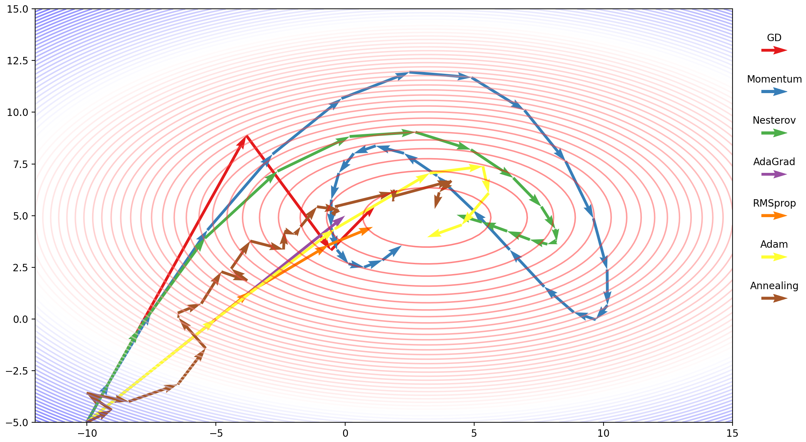
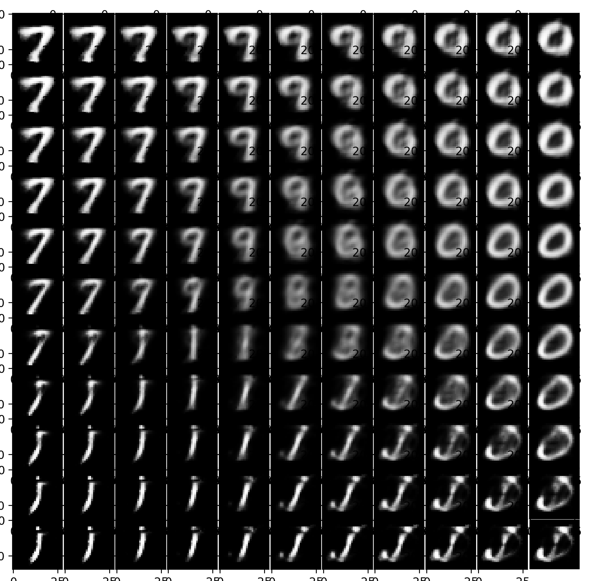

# Simple-Implementation-of-ML-Algorithms
### My simplest implementations of common ML algorithms from scratch.
* Most commonly used algorithms including Regressions, Graph Models, Deep Learning, Ensemble Learning, Reinforcement Learning, Optimization Algorithms, Swarm Intelligence, Heuristic Search, and other basic ML algorithms (see below list for more details).
* For an easy understanding, most of the codes implements only minimal version of the algorithm.
* The implementation uses only numpy.
* Most algorithms are within 100 lines of codes.

### Example Output
* Decision boundary visualization for implemented classifiers in `decision_boundary_visualization.py`

* Optimization process visualization in `optimization_visualization.py`: 

* digit images from the generative models trained with MNIST dataset:
    * Deep Convolutional Generative Adversarial Network (DC GAN) in `generative_adversarial_network.py`: 

    * Variational Autoencoders (VAE) in `variational_autoencoder.py`: 
    
    * Average image by Restricted Boltzmann Machine (RBM) `restricted_boltzman_machine.py`: 
    

### Implemented algorithms:

#### Regression Models
* Linear Regression `linear_regression.py`
    * Matrix solver
    * SGD/Adam solver
    * L1 regularization Lasso
    * L2 regularization Ridge
* Logistic Regression `logistic_regression.py`
    * Multi-class prediction
* Factorization Machines `factorization_machines.py`
    * Regularization
    * Classification/regression

#### Tree Models and Ensemble Learning
* Decision Tree `decision_tree.py`
    * Classification/regression
    * Different metrics
    * Feature importances
    * Sample weights
* Random Forest `random_forest.py`
* Adaboost `adaboost.py`
* Gradient Boosting Decision Tree (GBDT) `gradient_boosting_decision_tree.py`
    * Shrinkage
    * Line search of multiplier
* XGBoost `xgboost.py`
    * XGBoost Regression Tree
    * Shrinkage

#### Deep Learning
* Architecture
    * Supervised Model
        * Multilayer Perceptron (MLP) `multilayer_perceptron.py` / `simple_mlp.py`
        * Convolutional Neural Network (CNN) `convolutional_neural_network.py`
            * Convolutional layer with vectorized img2col and col2img
        * Recurrent neural network (RNN) `recurrent_neural_network.py`
            * Backpropagation through time (BPTT)
        * Long short-term memory (LSTM) `long_short_term_memory.py`
    * Generative Model
        * Restricted Boltzman Machine (RBM) `restricted_boltzman_machine.py`
        * Deep Belief Network (DBN) `deep_belief_network.py`
        * Variational autoencoder (VAE) `variational_autoencoder.py`
        * Generative Adversarial Network (GAN) `generative_adversarial_network.py`
            * Vanilla GAN
            * Deep Convolutional GAN (DCGAN)
            * discriminator vs generator
    * Reinforcement Learning
        * Deep Q-Network (DQN) `deep_q_network.py`
    * Transfer Learning (WIP)
* Layers `nn_layers.py` / `simple_cnn_layers.py`
    * Feedforward layer (dense)
    * Convolutional layer
    * Max pooling layer
    * Batch normalization layer
    * Softmax layer for classification
    * Activation layer
        * ReLU (Leaky)
        * Tanh (Leaky)
        * Sigmoid
    * Drop out layer (WIP)
* Training `nn_layers.py` / `multilayer_perceptron.py`
    * Mini Batch
    * He initialization
    * Loss functions
        * Mean squared error for regression
        * Cross entropy for classification
        * Log loss for classification
    * L1/L2 Regularization
    * Gradient check

#### Optimization Algorithms
* Gradient Descent and variations `optimization_visualization.py` / `multilayer_perceptron.py`
    * Stochastic Gradient Descent
    * Gradient Descent with Momentum
    * Nesterov Momentum
    * AdaGrad
    * RMSProp
    * Adam
* Monte Carlo method for global optimum
    * Simulated annealing  `optimization_visualization.py`

#### Graph Models
* Naive Bayes `naive_bayes.py`
    * Multinomial model
    * Document tokenizer
* Beyesian Network `beyesian_net.py`
    * Conditional probability MLE
    * Beyesian inference
* Hidden Markov Model `hidden_markov_model.py`
    * Fitting by Baum-Welch
    * Prediction by Viterbi
* Markov Random Field `markov_random_field.py`
    * Image Segmentation
    * Simulated Annealing for optimal Energy Function
* Conditional Random Field (WIP)

#### Other Supervised Models
* k-Nearest Neighbors (kNN) `k_nearest_neighbors.py`
* Support Vector Machine (SVM) `support_vector_machine.py`
    * Soft boundary
    * SMO algorithm
    * Different heuristics for selecting pairs in SMO

#### Swarm Intelligence
* Evolutionary Algorithm (EA) `evolutionary_algorithm.py`
    * Training a NN model by Genetic Algorithm
    * Selection by Fitness
    * Crossover approaches
    * Mutation rate
* Ant Colony Optimization (ACO) `ant_colony.py`
    * Traveling Salesman Problem

#### Heuristic Search
* Monte Carlo tree search `monte_carlo_tree_search.py`
    * Upper Confidence Bound 1 applied to trees (UCT)
* Minimax `minimax.py`

Feel free to use the code. Please contact me if you have any question: xiecng [at] gmail.com